# THE LAST SIGNAL｜最后的信号

> **Original Sci-Fi Visual Development & Cinematic Concept Project**

  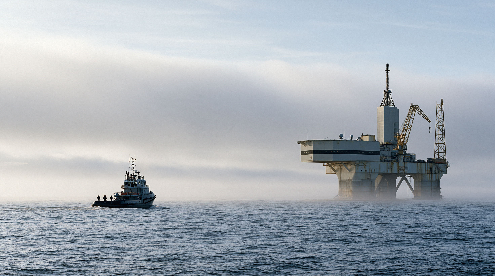

  <strong>Worldbuilding · Art Direction · Environment Design · Narrative Design · AI Visual Development</strong>

  <a href="https://moscowjiro.github.io/the-last-signal/">
    <strong>VIEW FULL CASE STUDY →</strong>
  </a>

---

## PROJECT OVERVIEW｜项目概述

《THE LAST SIGNAL》是一项个人原创的科幻视觉开发项目（Self-Initiated Visual Development Project）。

项目从 Narrative Concept 出发，围绕北大西洋废弃海洋观测站 **NAOS-06**，逐步完成 Worldbuilding、Art Direction、Environment Design、Character Direction、Prop Design 与 Cinematic Keyframes，并建立一套具有视觉连续性和叙事逻辑的 AI-assisted Visual Development Workflow。

项目的重点并非生成一系列独立的科幻图像，而是探索如何利用生成式工具构建一个具有统一世界观、空间逻辑、视觉语言与 Cinematic Narrative 的完整项目。

> **The world stays believable. The information does not.**

---

## THE PREMISE｜故事设定

**2041年，一座沉寂17年的北大西洋海洋观测站重新开始发送信号。**

三人调查小组被派往已经废弃的 **NAOS-06**。

进入设施后，他们发现部分系统仍然保持供电，而位于最深层的 Acoustic Monitoring System 正在接收一个与2007年最后记录一致的低频信号。

问题在于：

**2007年的那次信号，在系统计划发送它之前就已经被接收。**

> *The original signal was received before it was transmitted.*

  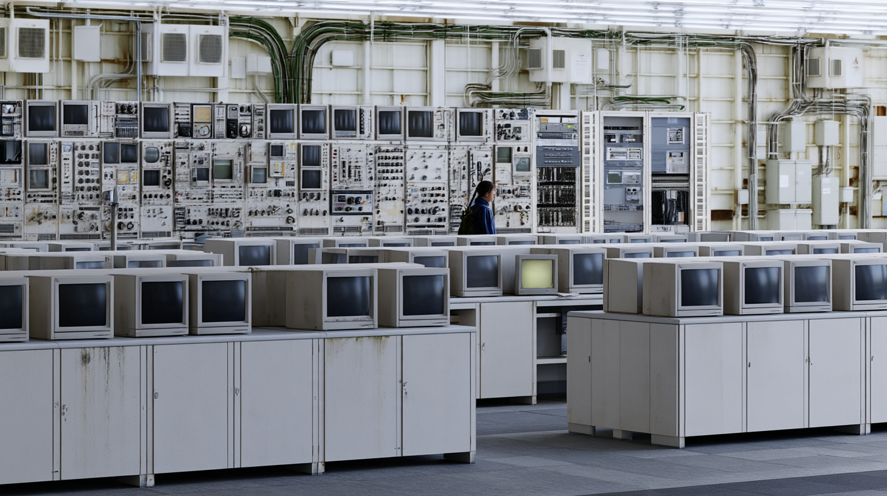

---

## VISUAL DIRECTION｜视觉方向

项目建立在三种核心视觉语言之上：

**Cold Atlantic Realism × Industrial Brutalism × Analog Technology**

寒冷、潮湿、低饱和度的 North Atlantic Environment，与 Reinforced Concrete、Painted Marine Steel、裸露 Utility Systems 以及 CRT、Reel-to-Reel Recorder、Analog Meter 等旧式技术共同构成 NAOS-06 的世界。

整个项目刻意避免：

`Neon` · `Hologram` · `Cyberpunk UI` · `Futuristic Interface` · `Visible Supernatural Entity`

所有异常都发生在一个仍然保持物理可信度的世界中。

  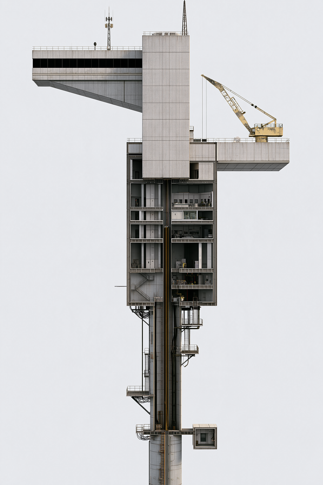
  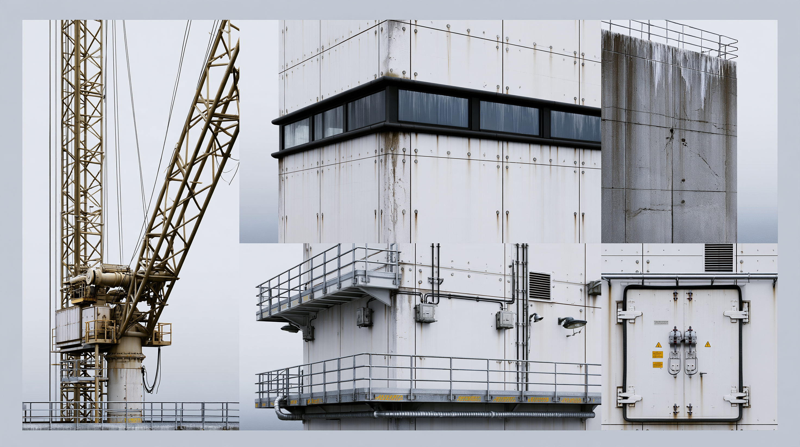

---

## NAOS-06｜空间设计

NAOS-06 表面是一座约建于 **1998–2004** 年间的 Offshore Oceanographic Research Station。

调查过程中却发现，官方图纸只记录了设施的一部分。

在约 **−52 m** 以下存在一条未被记录的 Vertical Shaft，并继续向海平面以下延伸超过100米，最终抵达：

### B12 / Approx. −176 m

最深处并不存在巨大的未来设施，而只是一间供一名操作员工作的 Listening Room。

其建筑方式和 Analog Equipment 暗示，这部分基础设施可能来自 **1970s–1980s**，明显早于上方的 NAOS-06。

**Normal → Unusual → Impossible → Intimate**

  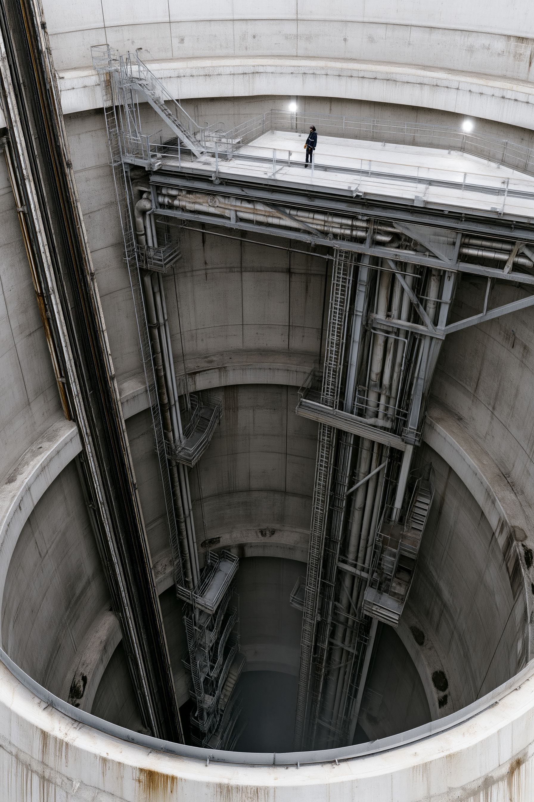
  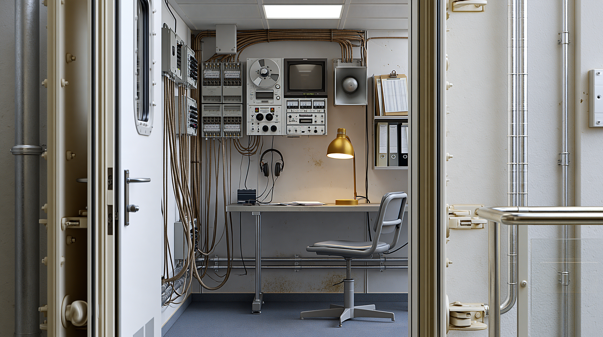

---

## THE SIGNAL｜信号

B12 的核心异常是一组 Ultra-Low-Frequency Acoustic Pattern：

| | |
|---|---|
| **Center Frequency** | `17.4 Hz` |
| **Duration** | `00:41.8` |
| **Received** | `14 OCT 2007 — 23:17:42 UTC` |
| **Scheduled Transmission** | `15 OCT 2007 — 06:00:00 UTC` |
| **Time Difference** | `06:42:18 EARLY` |

换句话说：

> **Effect appeared before cause.**

Received Recording 中还存在一个 Scheduled Output 中没有出现的微弱 Terminal Pulse。

因此，它并不是一个完全相同的“回声”。

  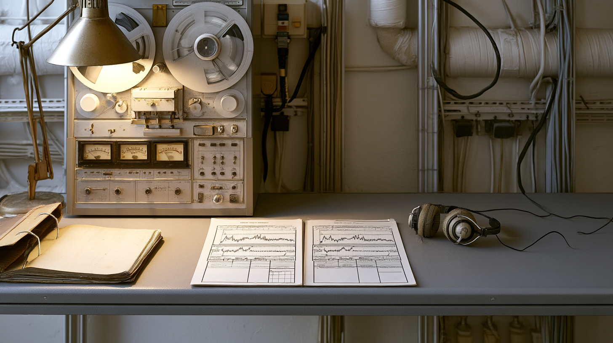

---

## DEEP-OCEAN INVESTIGATION｜深海调查

2041年的调查将信号追踪至 NAOS-06 下方的 Deep-Ocean Acoustic Array。

多个 Acoustic Sensors 几乎同时记录到相同模式：

**Δt ≈ 0**

现有阵列无法通过 Arrival-Time Difference 确定明确的 Direction of Arrival。

随后进行的 Deep-Ocean Survey 同样没有发现可以识别的 Physical Source。

  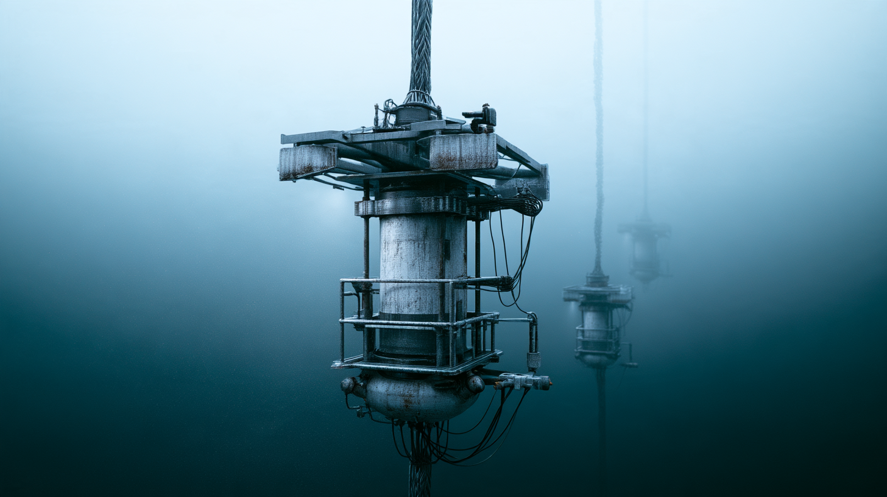
  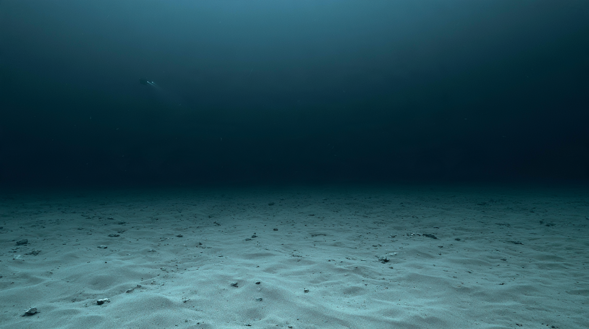

> **They searched for a source. The ocean gave them nothing.**

---

## MARA VENN｜角色方向

**Mara Venn · 31 · Signal Analyst**

Mara 被设计为 Civilian Scientific Field Researcher，而不是传统科幻作品中的 Action Hero。

她没有 Weapon、Tactical Armor 或 Futuristic Equipment，仅使用符合 Offshore Investigation 场景的 Waterproof Workwear、Radio、Headlamp 与基础 Field Equipment。

**Practical · Civilian · Observational**

> **She is there to observe, not to conquer.**

角色同时承担 Human Scale 的作用，通过人物与 Corridor、Shaft、B12 以及 Deep-Ocean Infrastructure 的比例关系建立空间尺度。

---

## CINEMATIC NARRATIVE｜电影化叙事

整个项目没有通过怪物、爆炸或直接可见的 Supernatural Visuals 建立悬念。

异常通过普通环境与技术系统逐渐显现：

**ARRIVAL → CORRIDOR → SIGNAL ROOM → SHAFT → B12 → ARRAY → DEEP OCEAN → THE LAST SIGNAL**

  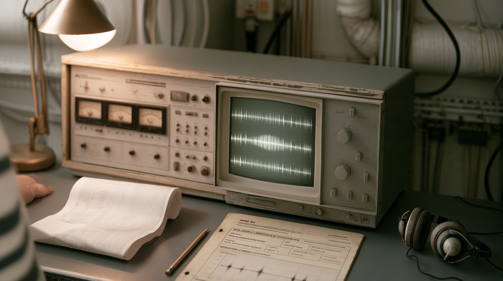
  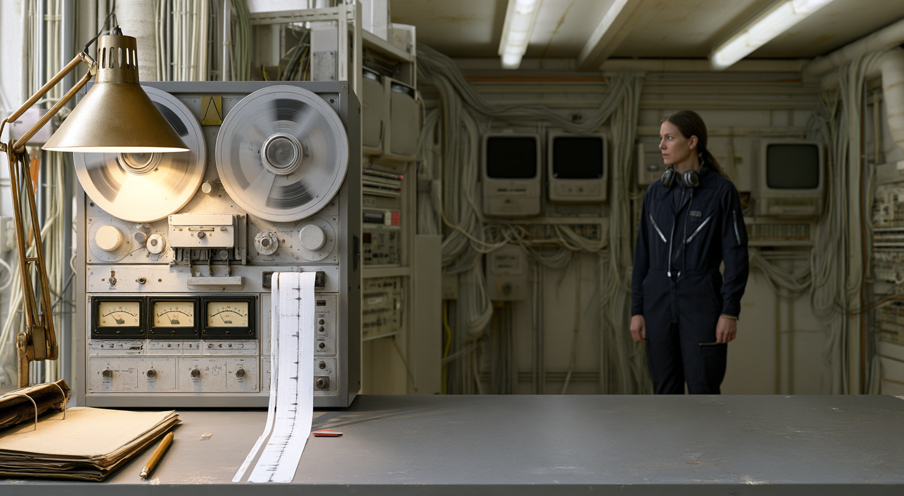

> **The transmission stopped. The signal did not.**

---

## VISUAL DEVELOPMENT WORKFLOW｜视觉开发流程

项目采用从 Narrative 到 Final Master 的结构化 Visual Development Workflow：

**CONCEPT**  
↓  
**WORLD BUILDING**  
↓  
**DESIGN SYSTEM**  
↓  
**VISUAL EXPLORATION**  
↓  
**SELECTION & ART DIRECTION**  
↓  
**REFINEMENT**  
↓  
**CINEMATIC KEYFRAMES**  
↓  
**FINAL MASTER**

生成式工具在项目中主要作为 **Visual Production Tool** 使用，而不是替代设计决策。

每轮 Visual Exploration 都根据已经建立的 Architecture、Material Language、Lighting、Scale、Character Continuity 与 Narrative Function 进行筛选。

**Images that were visually impressive but inconsistent with the world were rejected.**

---

## PROJECT SCOPE｜项目内容

- **Concept Development** — 核心概念、叙事结构与 Mystery System
- **Worldbuilding** — Timeline、空间逻辑与技术背景
- **Art Direction** — Visual Language、Color、Material 与 Lighting Rules
- **Environment Design** — NAOS-06、Interior、B12 与 Deep-Ocean Environment
- **Character Direction** — Mara Venn、Costume、Performance 与 Human Scale
- **Prop & Information Design** — Signal Record、Archive、Survey 与 Technical Evidence
- **Cinematic Design** — Composition、Camera Language 与 Narrative Keyframes
- **AI Visual Development** — Exploration、Consistency Control、Selection 与 Refinement

---

## FULL CASE STUDY｜完整作品集

完整项目包含 **16页 Visual Development Case Study**，覆盖 Narrative Premise、Worldbuilding、Facility Design、Character Direction、Signal System、Deep-Ocean Investigation、Production Workflow 与 Final Keyframes。

  <a href="https://moscowjiro.github.io/the-last-signal/">
    <strong>VIEW THE FULL 16-PAGE CASE STUDY →</strong>
  </a>

---

## ROLE

**Concept Development / Art Direction / Visual Development / Narrative Design / AI Production**

---

## ABOUT THE PROJECT

这是一个 Self-Initiated Project。

项目关注的不是单纯：

> **AI 能生成什么？**

而是：

> **如何建立规则、做出选择，并让几十张独立生成的画面最终属于同一个世界。**

---

  <strong>THE LAST SIGNAL — 2026</strong>

  © 2026 MoscowJiro

